# TGL · Document 07
## Miro Board Specification, MCP Integration Strategy, All Architecture Diagrams

**v2.0 note.** The board and diagrams below were specified for Vertex in isolation. Frame B1 and diagram C.10 in particular describe only the Vertex-side product and a lightweight opt-in networking feature; they predate the corrected product definition in Doc 00 §0.2 (TGL = Networking + Vertex) and Doc 01 §10 (the full Networking spec: Trust Score, Growth Points, business referrals, chapters, membership, events, awards). Treat B1 and C.10 as needing a refresh pass before the board is built, and use the three new diagrams in §C.21–C.23 below (ecosystem flywheel, membership grant pipeline, business referral lifecycle) as the source for that refresh rather than re-deriving them from the old frame.

---

# PART A — MCP capability inspection (actual, not assumed)

The Miro MCP server **is connected** in this environment. Its tools were inspected before anything in this document was written; nothing below is invented.

## A.1 Tools that actually exist

| Tool | Class | What it does |
|---|---|---|
| `canvas_get_canvas_composer_skill` | **Read (prerequisite)** | Returns the Canvas Composer SVG format spec. Must be called before any canvas write |
| `canvas_load_format_skill` | **Read** | Format-specific guidance; `format_name='diagramming'` with `notation` ∈ {flowchart, entity_relationship, uml_class, uml_sequence, free_form} |
| `canvas_read_as_svg` | **Read** | Reads board items back as SVG with `data-miro-id` on every element. Scopable via `widget_ids` |
| `canvas_create_from_svg` | **Create** | The primary creation tool. Parses Canvas Composer SVG into shapes, stickies, text, connectors, frames, tables, docs, images and Mermaid diagram widgets. Returns `result_svg` with ids stamped |
| `canvas_update_from_svg` | **Update (diff-based)** | Diffs against the live board on `data-miro-id` and applies only deltas. **Removing an element from the SVG does not delete it** — deletion requires an explicit `data-deleted="true"` per element |
| `board_create` | **Create** | Creates a board. Tool contract requires user confirmation first |
| `doc_create` | **Create** | Markdown document widget on a board |
| `comment_create` | **Create** | Canvas comment at coordinates |
| `board_show` | **Display** | Renders one interactive preview. Call once, at the end |
| `diagram_create_mermaid` / `diagram_update_mermaid` / `diagram_get_mermaid_instructions` | **Deprecated** | Superseded by the canvas path. Do not select these |
| `layout_create` / `layout_update` / `layout_get_dsl` | **Deprecated** | Superseded by the canvas path. Do not select these |

## A.2 Status in this session

`canvas_get_canvas_composer_skill` was called and **did not receive approval**, so no Miro board was created, read or modified. That is the correct outcome of a declined authorisation, and this document is written accordingly: everything below is a complete, executable specification rather than a report of work done.

**To execute it later:** approve the Miro tool calls and run the sequence in §A.4. Nothing else is required.

## A.3 Permission model to apply

| Tool | Treat as | Rule |
|---|---|---|
| `canvas_get_canvas_composer_skill`, `canvas_load_format_skill`, `canvas_read_as_svg`, `board_show` | **Read-only** | Safe to call freely |
| `canvas_create_from_svg`, `doc_create`, `comment_create` | **Additive** | Safe; creates new items, never removes |
| `canvas_update_from_svg` **without** `data-deleted` | **Additive/idempotent** | Safe; diff-based, partial documents are safe by design |
| `canvas_update_from_svg` **with** `data-deleted="true"` | **Destructive, not undoable** | Requires explicit per-item human confirmation naming the exact items. Never batch-delete |
| `board_create` | **Creates a new artefact** | Confirm with the user first, per the tool contract |

**Standing rule for this project: never send `data-deleted="true"` as part of a refresh.** Stale nodes are marked with a "SUPERSEDED" label and moved to an archive frame instead. Diagrams are cheap; an accidentally deleted board that a team has annotated is not.

## A.4 Execution plan (exact sequence)

```
 1. canvas_get_canvas_composer_skill()                          # required first, once
 2. canvas_load_format_skill('diagramming', 'flowchart')        # once
 3. canvas_load_format_skill('diagramming', 'entity_relationship')
 4. [confirm with user] board_create(name="Vertex — System Design", icon_emoji="⬡")
 5. canvas_create_from_svg(board_url, svg = frames only)        # 12 empty frames, laid out
 6. For each frame, in order B1…B12:
       canvas_create_from_svg(board_url + "?moveToWidget=<frame_id>", svg = that frame's content)
       # one call per frame — incremental, so a failure costs one frame, not the board
 7. canvas_read_as_svg(board_url)                               # VERIFY: node counts, edges, no overlaps
 8. canvas_update_from_svg(...)                                 # refine positions only; no deletions
 9. board_show(board_url)                                       # once, at the very end
```

**Verification step 7 is the one that gets skipped and shouldn't be.** Read the board back and check: every frame has its expected node count, every connector resolved to a real target, no diagram overflows its frame, no two frames overlap. A generated diagram that renders but is wrong is worse than one that failed loudly.

## A.5 Keeping the board synchronised with the documentation

The failure mode for architecture boards is drift: the board shows last quarter's architecture and nobody trusts it, so nobody updates it, so it drifts further.

**The mechanism:**
1. **Mermaid source in this repository is the source of truth.** `docs/diagrams/*.mmd`, one file per diagram, versioned in git.
2. The Miro board is a **rendered view** of those files, never edited directly for structural changes. Structural changes go through a PR on the `.mmd` file.
3. Each frame carries a footer text element: `Source: docs/diagrams/<name>.mmd · commit <sha> · updated <date>`. Anyone looking at the board can see whether it is current.
4. On merge to `main`, if any `.mmd` changed, a CI job posts a checklist item to refresh the affected frames. Frame refresh = `canvas_update_from_svg` on that one frame's diagram widget, sending its `data-miro-id` with a new Mermaid body. Additive and reversible.
5. Human annotations (stickies, comments) live **outside** the diagram widgets, in a dedicated annotation lane per frame, so a refresh never destroys team discussion.
6. Quarterly: `canvas_read_as_svg` the whole board, diff the node sets against the `.mmd` files, and report drift.

**Never do the reverse** — never treat the board as the source and try to reverse-engineer documentation from it. Diagrams edited by hand in a whiteboard tool cannot be reviewed, diffed or tested.

---

# PART B — Miro board specification

**One board: "Vertex — System Design", twelve frames in a 4×3 grid.** One board rather than twelve keeps navigation and permissions simple; frames give the separation the brief asked for.

**Layout grid:** each frame 1600×1000, 200px gutters. Row 1 y=0, row 2 y=1200, row 3 y=2400. Columns x = 0, 1800, 3600, 5400.

**Colour semantics (consistent across every frame — this is what makes the board readable at a glance):**

| Colour | Meaning |
|---|---|
| `#1D4ED8` blue | Application services / compute |
| `#059669` green | Data stores |
| `#7C3AED` purple | AI / intelligence components |
| `#D97706` amber | External third-party services |
| `#DC2626` red | Security, trust and verification boundaries |
| `#3F3F46` slate | Clients and user-facing surfaces |
| `#A1A1AA` grey | Deferred / future / not built at MVP |

Every frame contains: a title text (H1), a legend, the diagram widget, and an annotation lane on the right for stickies.

---

## Frame B1 — Product overview *(x=0, y=0)*

**Nodes:** `Entrepreneur (demand)` · `Provider (supply)` · `Vertex Platform` · `Discovery` `Verification` `Projects` `Networking` `Referrals` (capability boxes) · `Subscription revenue` · `Qualified leads`

**Edges:** Entrepreneur → Vertex (intent) · Vertex → Provider (qualified leads) · Provider → Vertex (subscription revenue) · Vertex → capability boxes (contains) · Referrals → Entrepreneur (loop back, dashed, labelled "growth loop")

**Grouping:** demand-side left, platform centre, supply-side right.
**Annotations:** three stickies stating assumptions A1, A2, A3 from Doc 00 §0.3, in amber.

## Frame B2 — User journey *(x=1800, y=0)*

Linear flowchart of the 15 screens U1–U15 (Doc 01 §3.1), with two decision diamonds: "Anonymous query limit reached?" → registration wall, and "Save as project?" → the retention branch. Colour: slate for screens, blue for decision points. A red note marks the one deliberate friction point (registration after one free query).

## Frame B3 — Business journey *(x=3600, y=0)*

The provider onboarding state machine (Doc 01 §5.1): DRAFT → PENDING_VERIFICATION → {VERIFIED, NEEDS_INFO, REJECTED} → ACTIVE, plus PAUSED / SUSPENDED / EXPIRED. Green for terminal-good states, red for terminal-bad, amber for waiting. A callout marks the deliberate sequencing decision: **verification before payment**.

## Frame B4 — Vertex AI flow *(x=5400, y=0)*

The four pipeline stages with their model class and latency budget annotated on each, plus the fallback ladder drawn as a parallel descending path in grey. Purple for AI components. A red boundary box encloses the untrusted-input zone (user query, provider content, OCR output) with the label "data, never instructions".

## Frame B5 — Search architecture *(x=0, y=1200)*

Dual retrieval paths (lexical / semantic) converging on RRF, then filters, scorer, reranker. The ranking function with its weights rendered as a table widget beside the diagram. A grey dashed box shows the OpenSearch migration path with the four migration triggers listed.

## Frame B6 — ER diagram *(x=1800, y=1200)*

Mermaid `erDiagram` of the core entities (§C.14). Grouped visually into five clusters matching module ownership: Identity · Marketplace · Trust · Commerce · Engagement. Module ownership boundaries drawn as coloured containers — this frame is the one engineers will reference most, so the clustering matters more than completeness.

## Frame B7 — API architecture *(x=3600, y=1200)*

Endpoint groups as containers with their auth requirements, rate limits and idempotency requirements on each. A separate lane shows the three protocols (REST / SSE / webhook) and what uses each. Red highlight on the webhook path with the label "the only path that grants entitlements".

## Frame B8 — Service interaction *(x=5400, y=1200)*

Sequence diagram: the full query flow across Browser → API → Intelligence → Bedrock → Postgres → Redis, with the SSE stream drawn as repeated returns. A second sequence below it shows the payment webhook flow, which is the other interaction most likely to be implemented wrongly.

## Frame B9 — AWS infrastructure *(x=0, y=2400)*

VPC with three subnet tiers across 3 AZs, drawn as nested containers. Every AWS service from Doc 04 §1.2 placed in its correct subnet. Security-group relationships drawn as red dashed arrows. VPC endpoints shown explicitly. A note lists the services **deliberately not used** and why — that list prevents more architecture debates than the diagram itself.

## Frame B10 — Verification pipeline *(x=1800, y=2400)*

The state machine from Doc 04 §2.2, with a parallel swimlane showing which actor may trigger each transition (System / Reviewer / Provider / Webhook). The risk-score bands and their routing rendered as a decision block. Red for the T3-requires-a-human rule.

## Frame B11 — Security architecture *(x=3600, y=2400)*

Defence-in-depth as concentric layers: Edge (WAF/CloudFront) → Network (VPC/SG) → Application (authn/authz/validation) → Data (encryption/KMS) → Audit. The STRIDE table as a table widget. The trust boundary between trusted and untrusted input drawn explicitly in red, matching B4.

## Frame B12 — Deployment architecture *(x=5400, y=2400)*

CI/CD pipeline left to right: PR gates → merge → build → staging → approval → blue/green production, with the rollback path drawn in red. The four environments as containers. The expand/contract migration pattern shown as an inset.

---

# PART C — All architecture diagrams (Mermaid)

Store each as `docs/diagrams/<name>.mmd`.

## C.1 High-level system architecture

```mermaid
flowchart TB
    subgraph Clients
        WEB[Web · Next.js]
        PWA[Mobile PWA]
        ADM[Admin Console]
    end
    CDN[CloudFront + WAF]
    ALB[Application Load Balancer]

    subgraph API["API — NestJS modular monolith (ECS Fargate)"]
        AUTH[Auth & Users]
        BIZ[Business & Providers]
        SRCH[Search & Matching]
        VER[Verification]
        PAY[Subscriptions & Payments]
        PROJ[Projects]
        NET[Networking]
        REF[Referrals]
        NOTIF[Notifications]
        ADMIN[Admin & Moderation]
    end

    INTEL[Intelligence Service · FastAPI (Phase 3)]
    WORK[Queue Workers · Fargate]
    LAM[Lambda · webhooks, schedules, S3 triggers]

    subgraph Data
        PG[(PostgreSQL 16<br/>+ pgvector + PostGIS)]
        RDS_R[(Read Replica)]
        REDIS[(Redis)]
        S3[(S3 · private documents)]
        OS[(OpenSearch<br/>future)]
    end

    subgraph External
        BR[Amazon Bedrock<br/>India Geo profiles]
        RZP[Razorpay]
        KYB[KYB provider<br/>GSTIN · MCA21 · UDYAM]
        MAPS[Google Maps]
        SES[SES · SMS · WhatsApp]
    end

    WEB --> CDN
    PWA --> CDN
    ADM --> CDN
    CDN --> ALB --> API
    API --> INTEL
    API --> PG
    API --> REDIS
    API --> S3
    API -->|outbox| SQS[[SQS / EventBridge]]
    SQS --> WORK
    SQS --> LAM
    WORK --> PG
    WORK --> KYB
    WORK --> SES
    INTEL --> BR
    INTEL --> PG
    INTEL --> REDIS
    API --> RZP
    RZP -.webhook.-> LAM
    API --> MAPS
    API --> RDS_R
    WORK -.future.-> OS
    SRCH -.future.-> OS
```

## C.2 AWS architecture

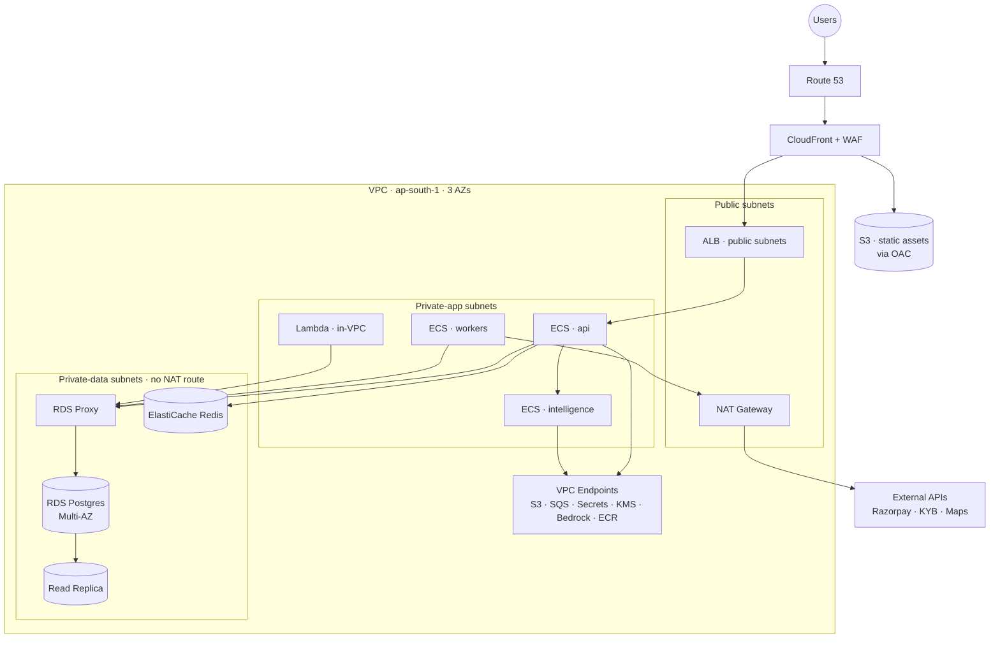

## C.3 User journey

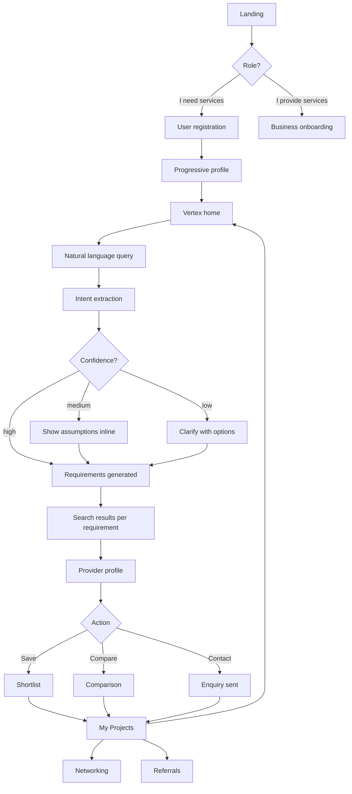

## C.4 Business onboarding flow

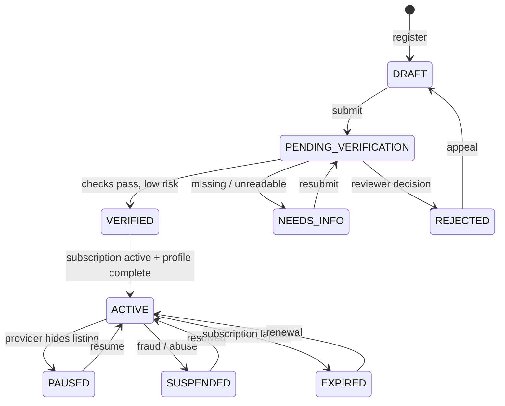

## C.5 Vertex AI query flow (Phase 3)

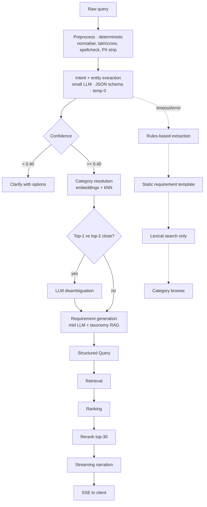

## C.6 Search architecture

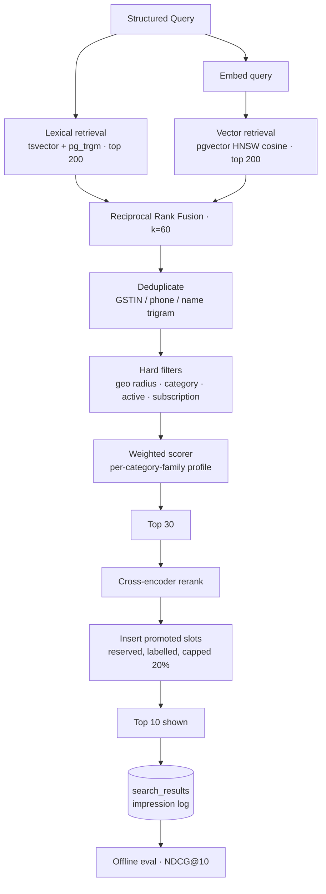

## C.7 Verification pipeline

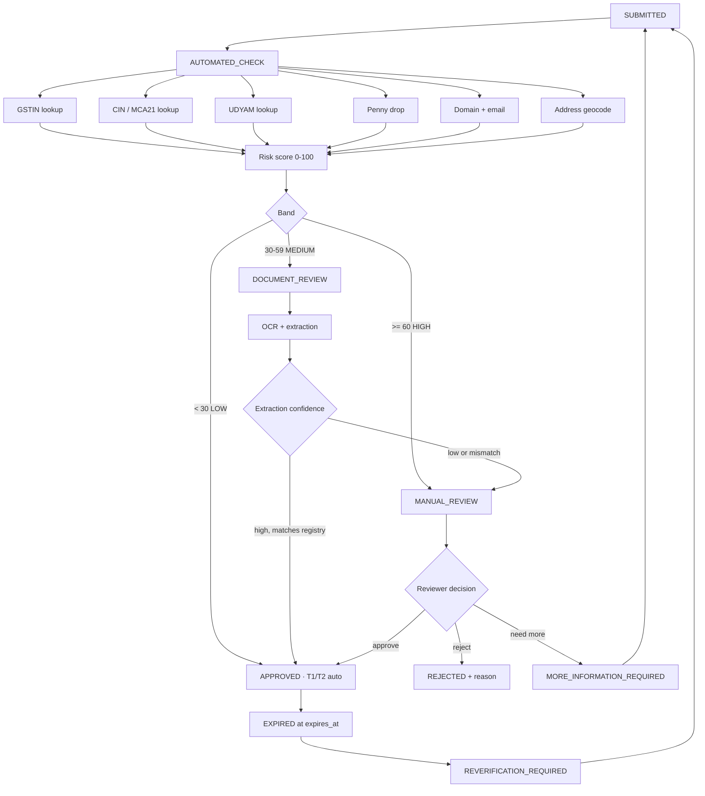

## C.8 Subscription and payment flow

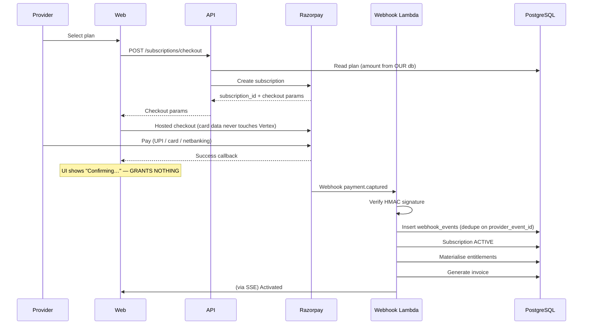

## C.9 Referral flow

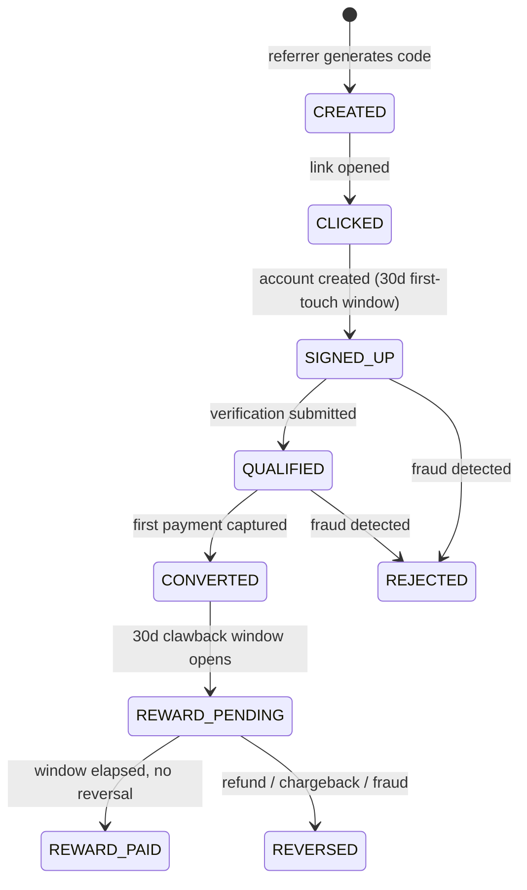

## C.10 Networking flow

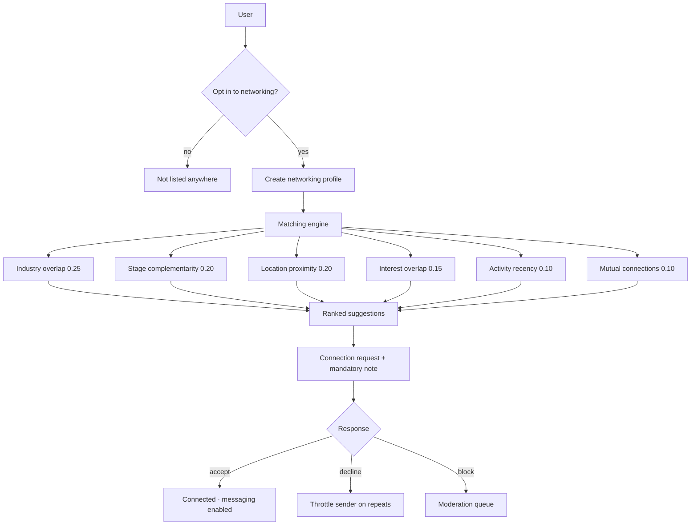

## C.11 Project architecture

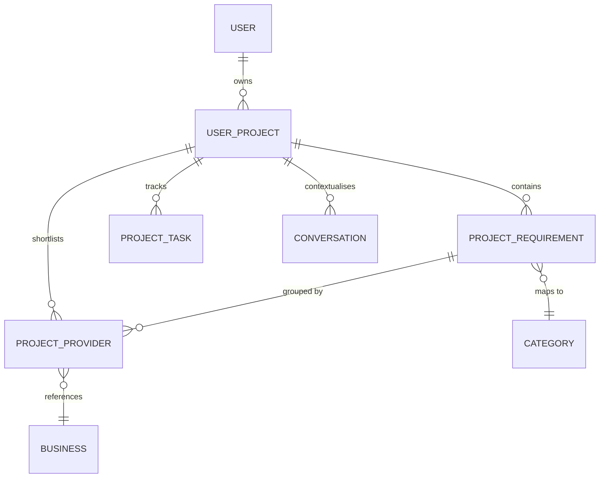

## C.12 Notification architecture

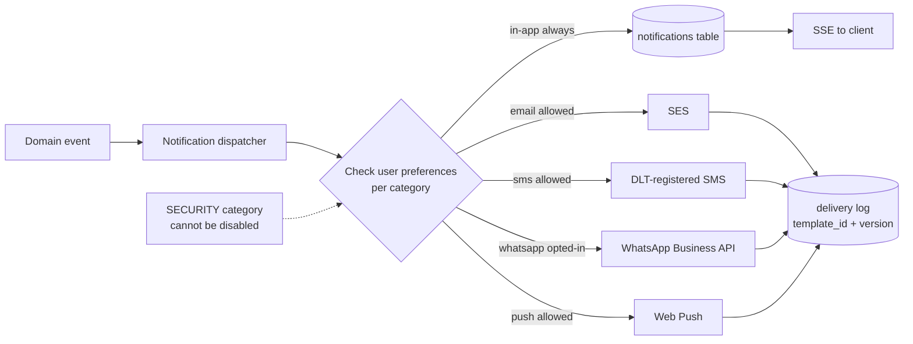

## C.13 Event-driven architecture

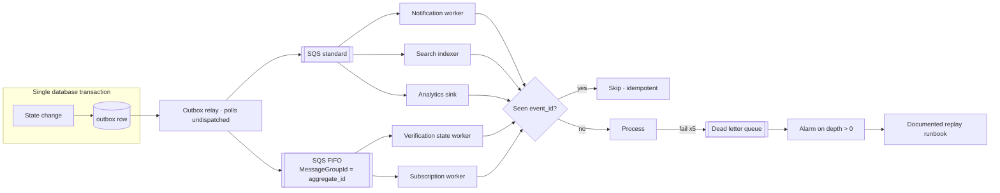

## C.14 ER diagram (core)

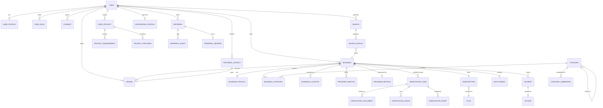

## C.15 Deployment architecture

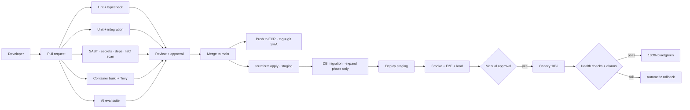

## C.16 Security architecture

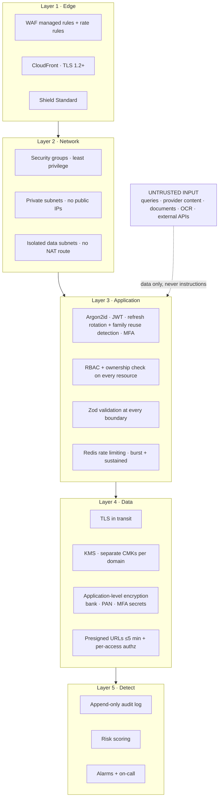

## C.17 CI/CD pipeline

*(Rendered as C.15; kept as a separate `.mmd` file for the Miro frame B12 so the pipeline can be refreshed independently of the deployment topology.)*

## C.18 Data flow diagram

```mermaid
flowchart LR
    U[User] -->|query text| API
    API -->|normalised, PII-stripped| INTEL[Intelligence (Phase 3)]
    INTEL -->|prompt| BR[Bedrock · India Geo (Phase 3)]
    BR -->|structured JSON| INTEL
    INTEL -->|structured query| API
    API -->|SQL + vector| PG[(PostgreSQL)]
    PG -->|candidates| API
    API -->|SSE| U

    P[Provider] -->|profile data| API
    P -->|documents| S3[(S3 private)]
    S3 -->|S3 event| OCRW[OCR worker]
    OCRW -->|extracted fields| PG
    API -->|identifiers only| KYB[KYB provider]
    KYB -->|registry result| PG

    P -->|payment| RZP[Razorpay]
    RZP -->|signed webhook| LAM[Webhook Lambda]
    LAM -->|entitlements| PG

    PG -->|events via outbox| SQS[[SQS]]
    SQS --> AN[(Analytics)]

    classDef sensitive fill:#FEE2E2,stroke:#DC2626
    class S3,KYB,RZP sensitive
```

## C.19 Provider ranking pipeline

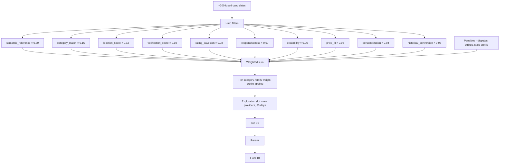

## C.20 AI architecture (Phase 3)

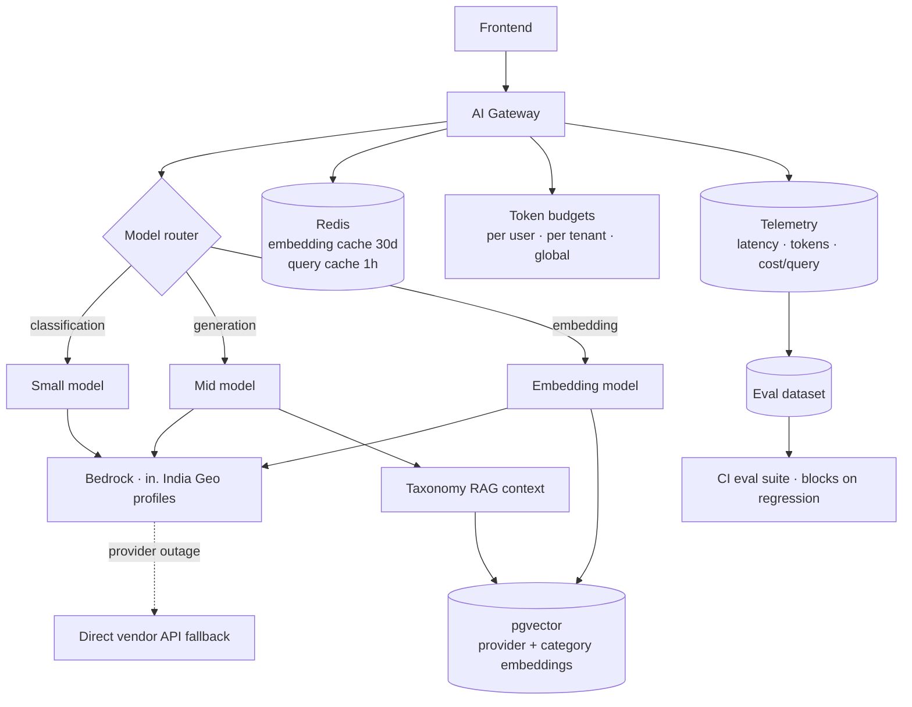

---

## C.21 TGL ecosystem flywheel (new — Doc 00 §0.2a)

```mermaid
flowchart LR
    EV[TGL Event] --> REG[Registration]
    REG --> MEM[TGL Membership pending<br/>then 3 calendar months after Grand Finale]
    MEM --> NET[Networking participation<br/>Trust Score · Growth Points]
    NET --> VER[TGL Verified badge<br/>admin-controlled criteria]
    VER --> VTX[Vertex profile credibility]
    VTX --> DISC[Discovered by a Vertex user]
    DISC --> ENQ[Enquiry / business closed]
    ENQ --> STORY[Success story]
    STORY --> MEDIA[TGL Podcast / SkyKeen Media]
    MEDIA --> AWARE[More awareness]
    AWARE --> EV2[Next TGL Event]
    EV2 -.same loop.-> REG
```

## C.22 Membership grant + renewal pipeline (new — Doc 04 §4.1a)

```mermaid
sequenceDiagram
    participant M as Prospective member
    participant W as Web
    participant A as API
    participant R as Razorpay
    participant DB as PostgreSQL

    M->>W: Register for a TGL event
    W->>A: POST /events/{id}/register
    A->>R: Create order (event fee, from OUR db)
    M->>R: Pay
    R->>A: Webhook payment.captured (signature verified)
    A->>DB: event_registrations.status = REGISTERED
    A->>DB: EventRegistrationConfirmed emitted
    A->>DB: tgl_memberships row created<br/>pathway=EVENT_REGISTRATION, status=PENDING
    A->>DB: NetworkingProfile auto-created
    Note over M,DB: After Grand Finale completion — activate for 3 calendar months
    M->>W: Select 3/6/12-month plan
    W->>A: POST /memberships/renew
    A->>R: Create order (amount from membership_plans)
    M->>R: Pay
    R->>A: Webhook payment.captured
    A->>DB: current_period_end extended, Growth Points redemption applied (capped)
```

## C.23 Business referral lifecycle (new — Doc 01 §10.3)

```mermaid
stateDiagram-v2
    [*] --> GIVEN: member refers a business opportunity
    GIVEN --> ACCEPTED: referred_to member accepts
    GIVEN --> DECLINED: referred_to member declines
    ACCEPTED --> MEETING_DONE
    MEETING_DONE --> BUSINESS_CLOSED
    BUSINESS_CLOSED --> REVENUE_GENERATED
    BUSINESS_CLOSED --> [*]: Growth Points awarded (high weight, Doc 01 §10.4)<br/>Trust Score input (both parties)
    GIVEN --> EXPIRED: no response within SLA
    note right of BUSINESS_CLOSED
        Distinct from the growth/acquisition
        referral state machine (C.9) — different
        table, different trigger, different reward
    end note
```

---

# PART D — Required tables index

Every table the brief asked for, and where it lives:

| Table | Document |
|---|---|
| Technology stack + alternatives | Doc 00 §0.6 |
| Architectural decisions (12 ADRs) | Doc 00 §0.7 |
| Database entities | Doc 03 §2 |
| API endpoints | Doc 03 §4.2 |
| Roles & permissions | Doc 04 §3.2 |
| Subscription plans / feature matrix | Doc 01 §6.2 |
| Verification methods + decision matrix | Doc 04 §2.3 |
| AWS services (and services deliberately excluded) | Doc 04 §1.2 |
| Roadmap phases | Doc 06 §1 |
| Engineering epics | Doc 06 §10 |
| Security threats (STRIDE) | Doc 04 §3.3 |
| Cost assumptions | Doc 06 §8 |
| Technical risks | Doc 06 §9 |
| KPIs | Doc 06 §6.3 |
| Ranking weights + justification | Doc 02 §4.3 |
| Rate limits | Doc 04 §3.5 |
| Data retention | Doc 03 §8 |
| Failure modes | Doc 04 §8 |
| Open decisions | Doc 00 §0.10 |
| TGL brand history / platform structure | Doc 00 §0.2a |
| Networking (Trust Score, Growth Points, business referrals, chapters, awards) | Doc 01 §10 |
| Membership rules and pricing | Doc 01 §13 |
| Events, Awards, Podcasts | Doc 01 §14 |
| Navigation (5-tab structure) | Doc 01 §4, Doc 05 (header) |
| Membership/event schema | Doc 03 §2.6a |
| Membership payment flow | Doc 04 §4.1a |
| Networking-corrected MVP scope | Doc 06 §2, banner |
